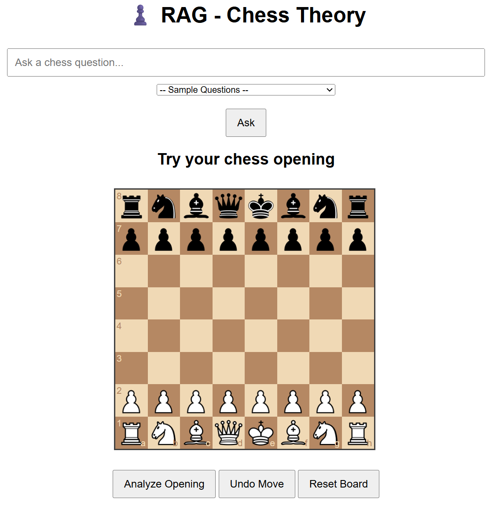
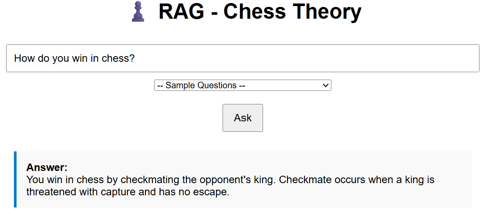
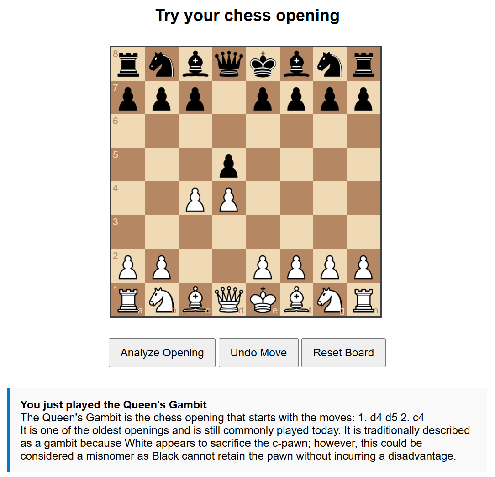

In this project, a Retrieval-Augmented Generation (RAG) chatbot is deployed to answer chess related questions.

Information Database:
- The database Chess_Chunks.csv contains textual information about chess pieces, rules, tactics, and popular openings, collected from Wikipedia.
- These texts are embedded into vector representations using the sentence transformer model: all-MiniLM-L6-v2.
- The resulting embeddings are stored in a FAISS index for similarity search.

Answering Questions:
- When a user submits a question, it is first embedded using the same sentence transformer.
- The embedding is compared against the FAISS index to retrieve the most relevant text chunks.
- To generate an answer, the Mistral-7B-Instruct-v0.3 language model (hosted via the Hugging Face Inference API) is prompted.
- The LLM is instructed to only use the retrieved information to answer to prevent hallucinations or false information.

Chess Opening:
- Users can also experiment with different chess openings through an interactive board.
- The sequence of played moves is compared to a database of known openings.
- If a match is found, the corresponding opening name and description are displayed.

HTML Page View

Sample Question and Answer

Sample Opening Description

